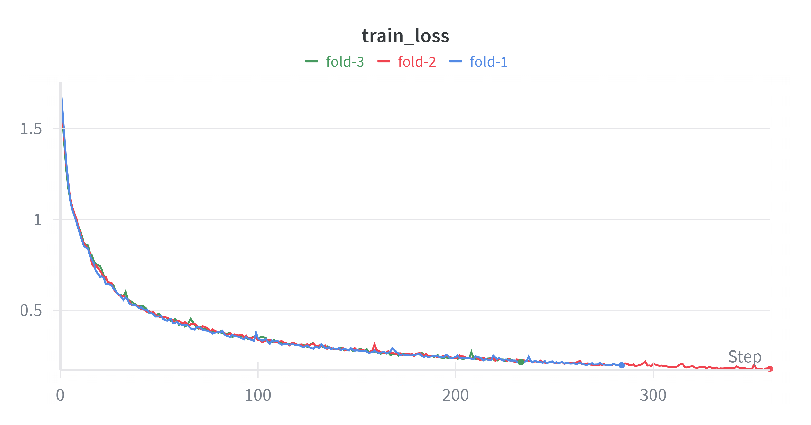
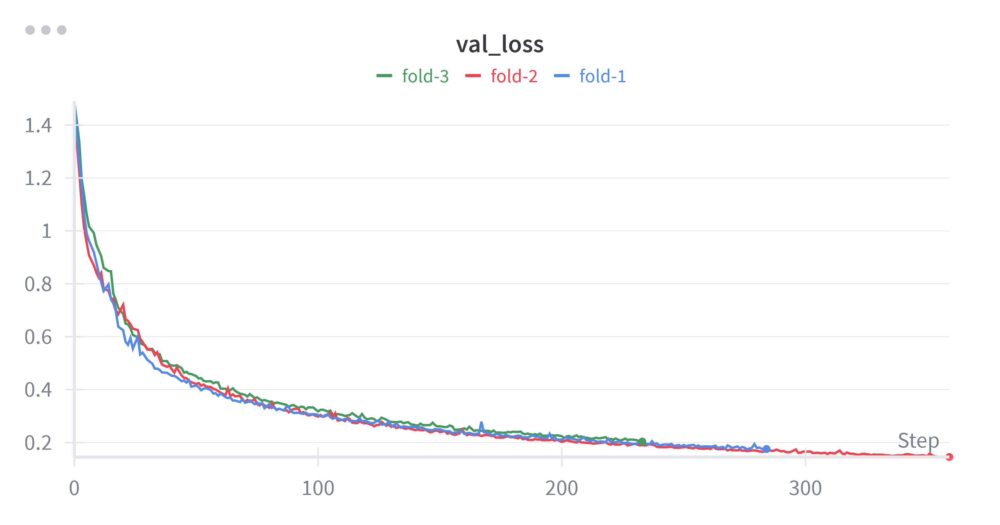
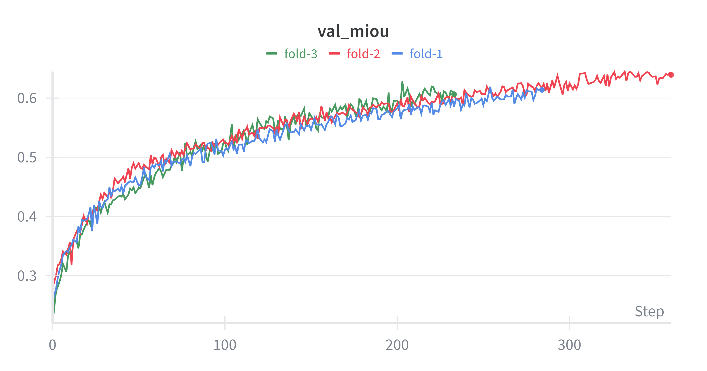

# Kathmandu Valley Satellite Image Segmentation

[](https://huggingface.co/docs/transformers/model_doc/segformer)
[](#)

This repository contains a semantic segmentation pipeline for satellite images of Kathmandu Valley, Nepal. A custom dataset was created, the SegFormer-B0 model was fine-tuned, and predictions for land-use classes were generated for urban planning and GIS applications.

## Getting Started

### Prerequisites
To run this project, you will need Python 3.8+ and the following libraries:
* `torch` (PyTorch)
* `transformers` (Hugging Face)
* `albumentations` (For data augmentation)
* `opencv-python`
* `matplotlib`

### Installation
1. Clone the repository:
   ```bash
   git clone git@github.com:praniil/satellite-image-segmentation.git
   cd kathmandu-satellite-segmentation

---

## Hugging Face Integration

The fine-tuned model and feature extractor are hosted on the Hugging Face Hub. You can use the model directly for inference on new satellite tiles with the following script:

### Direct Inference Script
```python
import torch
import numpy as np
from PIL import Image
import matplotlib.pyplot as plt
from transformers import SegformerForSemanticSegmentation, SegformerFeatureExtractor

# Setup device
device = "cuda" if torch.cuda.is_available() else "cpu"

# Load model and processor from Hugging Face
HF_REPO = "Pranilllllll/segformer-satellite-segementation"
model = SegformerForSemanticSegmentation.from_pretrained(HF_REPO).to(device)
processor = SegformerFeatureExtractor.from_pretrained(HF_REPO)
model.eval()

# Load image
image_path = "path_to_your_satellite_image.png"
image = Image.open(image_path).convert("RGB")

# Preprocess and Inference
inputs = processor(images=image, return_tensors="pt")
pixel_values = inputs["pixel_values"].to(device)

with torch.no_grad():
    outputs = model(pixel_values=pixel_values)
    logits = outputs.logits  # [1, 7, H, W]

# Predict and Map Colors
pred_mask = torch.argmax(logits, dim=1).squeeze().cpu().numpy()
colors = np.array([
    [0, 0, 0], [128, 0, 0], [0, 128, 0], [0, 0, 128], 
    [0, 128, 128], [128, 128, 0], [128, 0, 128]
], dtype=np.uint8)
seg_image = colors[pred_mask]

# Save Result
plt.imsave("prediction.png", seg_image)
print("Inference complete. Prediction saved as prediction.png")
```

### Area of Interest
* **Location:** Kathmandu Valley, Nepal
* **Method:** Divided into grid tiles; each tile represents a satellite image patch.

### Dataset Statistics
* **Total images:** ~400
* **Resolution:** 512 x 512 (after resizing)
* **Annotation tool:** CVAT
* **Task:** Multi-class semantic segmentation

### Annotation Classes
The dataset contains 7 distinct classes:

| Class ID | Class Name | BGR Color |
| :--- | :--- | :--- |
| 0 | Background | (0, 0, 0) |
| 1 | Residential Area | (128, 0, 0) |
| 2 | Road | (0, 128, 0) |
| 3 | River | (0, 0, 128) |
| 4 | Forest | (0, 128, 128) |
| 5 | Unused Land | (128, 128, 0) |
---

## Model Architecture

* **Backbone:** SegFormer-B0
* **Encoder:** MiT (Mix Transformer) captures global context without the need for positional encoding.
* **Decoder:** Lightweight MLP (Multi-Layer Perceptron) produces per-pixel class predictions.
* **Output:** Segmentation mask with 7 land-use classes.

---

## Fine-Tuning Strategy

The model was fine-tuned using the following configuration:

* **Input size:** 512 x 512
* **Batch size:** 16
* **Optimizer:** AdamW
* **Loss function:** Weighted Cross-Entropy (to handle class imbalanc
* **Learning rate:** 3e-5
* **Epochs:** 300 (Early stopping patience = 25)
* **Cross-validation:** 3-fold
* **Mixed precision:** Enabled

### Data Augmentation
To improve generalization, the following augmentations were applied:
* Horizontal and Vertical flips
* Random 90-degree rotations
* Resizing to 512 x 512

### Class Imbalance Handling
Computed inverse frequency class weights were applied to the loss function so that rare classes (like Roads or Rivers) contribute proportionally during training.

---

## Metrics and Evaluation

* **Mean Intersection over Union (mIoU):** Primary performance metric.
* **Per-class IoU:** To evaluate accuracy across different land types.
* **Qualitative Inspection:** Visual comparison of predicted masks against ground truth.
* **Cross-validation:** Results are reported as mean +/- standard deviation of mIoU across folds to ensure statistical robustness.

---
## Training Performance

The following plots visualize the training process. For a 3-fold setup, it is common to show the curves from the best-performing fold or the averaged curves.

| Training Loss | Validation Loss |
| :---: | :---: |
|  |  |

| Mean IoU (mIoU) | Gradient Norm |
| :---: | :---: |
|  |  |

> **Note:** The stable Gradient Norm indicates that the SegFormer-B0 encoder (MiT) converged effectively without vanishing gradient issues common in deep transformers.

---

## Inference Pipeline

The inference process follows these steps:
1. Preprocess input image to match model input format (normalization and resizing).
2. Forward pass through the fine-tuned SegFormer-B0.
3. Generate predicted mask using `argmax` per pixel.
4. Convert the single-channel mask to an RGB visualization based on the class color map.
5. Save and visualize predictions alongside original images.

---

## Sample Visualization
Below are examples of the model output where the original satellite image and the predicted segmentation mask are displayed side-by-side.

### Sample 1: Segmented Residential Area, Road, River, Agricultural land and Forest


### Sample 2: Segmented Residential Area and River
